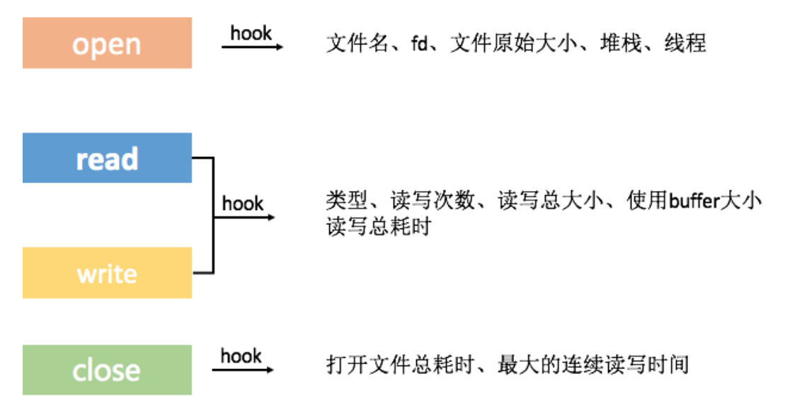

### IO监控维度
1. 主线程不允许读写IO，或者不允许读写大文件
2. 读写的缓存不能太小，PAGE_SIZE >= 4096
3. 资源要释放，File close

主要是监控这几个方法：
```c
int open(const char *pathname, int flags, mode_t mode);
ssize_t read(int fd, void *buf, size_t size);
ssize_t write(int fd, const void *buf, size_t size); write_cuk
int close(int fd);
```
