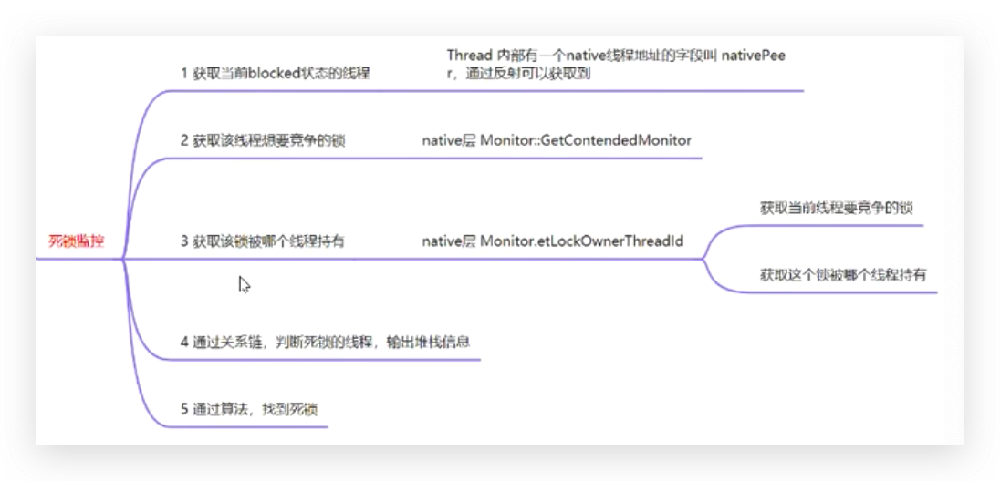

### 死锁监控
思路：

为了动态调用so里的 `GetContendedMonitor` 和 `GetLockOwnerThreadId`方法，需要使用 dlopen、dysym找到函数地址。
实现看 `NativeThreadMonitor.kt`

### 监控线程存活时间
思路：当线程创建时，会调用 `Thread::CreateNativeThread`，具体看[这里](http://aospxref.com/android-14.0.0_r2/xref/art/runtime/thread.cc)
```c
void Thread::CreateNativeThread(JNIEnv* env, jobject java_peer, size_t stack_size, bool is_daemon) {
...
//创建线程，会调用 CreateCallback
pthread_create_result = pthread_create(&new_pthread,
                                             &attr,
                                             gUseUserfaultfd ? Thread::CreateCallbackWithUffdGc
                                                             : Thread::CreateCallback,
                                             child_thread);
...
}
```
hook `CreateCallback`，在它前后记录时间，就能知道线程执行执行，这里这是 inline hook，具体看`NativeThreadMonitor.kt`

### 线程泄漏监控


### 线程收敛

